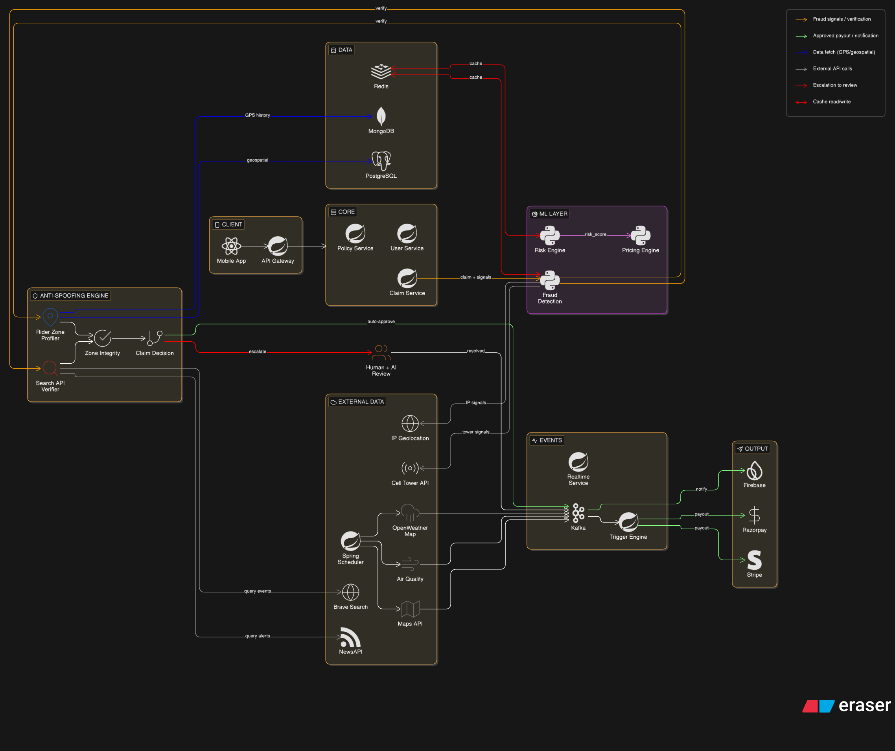

# GigShield — AI-Powered Parametric Income Protection for India's Gig Delivery Workers

> **Hackathon**: Guidewire DEVTrails 2026 — "Unicorn Chase"
> **Phase 1 Submission**: Ideation & Foundation (Deadline: March 20, 2026)
> **Theme**: AI-Enabled Insurance for India's Gig Economy

---

## Table of Contents

1. [Problem Statement](#1-problem-statement)
2. [Chosen Persona: Q-Commerce Delivery Partner](#2-chosen-persona-q-commerce-delivery-partner)
3. [Solution Overview](#3-solution-overview)
4. [Weekly Premium Model](#4-weekly-premium-model)
5. [Parametric Trigger Definitions](#5-parametric-trigger-definitions)
6. [AI/ML Integration Plan](#6-aiml-integration-plan)
7. [Platform Justification: Mobile-First Native App](#7-platform-justification-mobile-first-native-app)
8. [Architecture Overview](#8-architecture-overview)
9. [Tech Stack](#9-tech-stack)
10. [Adversarial Defense & Anti-Spoofing Strategy](#10-adversarial-defense--anti-spoofing-strategy)
    - [Threat Model](#101-the-threat-model)
    - [Multi-Signal Verification Stack](#102-the-multi-signal-verification-stack)
    - [Fraud Ring Detection](#103-fraud-ring-detection)
    - [Decision Engine (GREEN/YELLOW/RED)](#104-the-decision-engine)
    - [Protecting Honest Workers](#105-protecting-honest-workers-ux-balance)
    - [What the Syndicate Cannot Fake](#106-what-the-syndicate-cannot-fake)

---

## 1. Problem Statement

India's gig delivery ecosystem employs over **11 million platform workers** on apps like Zepto, Blinkit, Swiggy Instamart, Zomato, Amazon, and Dunzo. These workers operate on a **zero-safety-net model** — earning only when they deliver.

When external disruptions occur — heavy rainfall, cyclones, AQI-based shutdowns, civil curfews, floods, app platform outages, or extreme heat advisories — delivery workers lose **20–30% of their monthly income** in a matter of hours. They have no collective bargaining power, no employer-backed insurance, and no recourse.

**Existing gaps:**
- Health/accident insurance products exist but don't cover *lost wages*
- Vehicle insurance covers the bike, not the rider's earnings
- No product in the market addresses **parametric income protection** tuned to gig workers
- Manual claims processes are too slow and inaccessible for daily-wage earners

**GigShield's answer:** An AI-powered, parametric insurance platform that *automatically* detects disruptions, verifies eligibility, and initiates payouts — without the worker filing a single form.

---

## 2. Chosen Persona: Q-Commerce Delivery Partner

**Persona**: A Zepto/Blinkit/Swiggy Instamart delivery partner in a Tier-1 Indian city (Mumbai, Delhi, Bengaluru, Hyderabad, Pune).

### Why Q-Commerce?

| Factor | Q-Commerce (Zepto/Blinkit) | Food (Zomato/Swiggy) | E-Commerce (Amazon/Flipkart) |
|--------|---------------------------|----------------------|------------------------------|
| Delivery frequency | 15–25 orders/day | 8–15 orders/day | 3–8 orders/day |
| Hyperlocal sensitivity | Extreme (dark store zones) | High | Moderate |
| Weather vulnerability | Critical (monsoon paralysis) | High | Low-Medium |
| Worker density per zone | Very high (cluster-based) | Medium | Spread out |
| Fraud surface area | High (zone-based clustering) | Medium | Low |

Q-commerce workers operate within **tight geographic zones** anchored to dark stores, making:
- Parametric triggers more precise (zone-level, not city-level)
- Fraud detection more nuanced (cluster behavior becomes a signal)
- Income modeling more predictable (orders/hour baselines are tight)

### Persona Profile: "Ravi, 28, Zepto Partner, Andheri East"

- Works 10 AM – 10 PM, ~20 deliveries/day
- Earns ₹600–₹900/day, ~₹4,500–₹6,000/week
- Rides a scooter, operates within a 4 km dark store radius
- Pays rent weekly, sends remittances monthly
- Has no savings buffer beyond 2–3 days
- Owns a smartphone (Android), uses UPI for all payments

**Key Disruptions Ravi faces:**
1. Mumbai monsoon — zone completely unserviceable for 4–6 hours
2. AQI shutdown advisory — city-wide app slowdown
3. Cyclone/storm warning — platform voluntarily suspends operations
4. Local political bandh — roads blocked, platform auto-pauses
5. Platform outage (Zepto app down) — zero orders possible regardless of effort

---

## 3. Solution Overview

GigShield is a **parametric income insurance platform** built for Q-commerce delivery partners. It requires no claims filing — the system monitors external signals, detects covered disruptions, verifies worker eligibility, and triggers a payout automatically.

### How It Works — End-to-End Flow

```
Worker Onboards → Selects Weekly Plan → Premium Auto-Deducted
        ↓
Real-Time Monitoring: Weather + Platform + Traffic APIs
        ↓
Disruption Detected in Worker's Zone
        ↓
Eligibility Check: Did disruption fall within worker's established shift window?
        ↓
Anti-Spoofing Verification (Multi-signal)
        ↓
Claim Auto-Approved OR Flagged for Human+AI Review
        ↓
Payout to UPI within 60 seconds
```

### What GigShield Covers (and doesn't)

| Covered | Not Covered |
|---------|-------------|
| Lost income during weather shutdowns (rain, cyclone, AQI) | Vehicle repairs or damage |
| Lost income during platform-declared outages | Medical/accident expenses |
| Lost income during civil disruptions (curfew, bandh) | Personal illness or fatigue |
| Lost income during natural disasters (flood, earthquake alerts) | Low-order days due to competition |

---

## 4. Weekly Premium Model

### Why Weekly?

Q-commerce workers are paid **weekly or bi-weekly** by platforms. Daily income is variable; monthly commitments are too abstract. Weekly premiums align with:
- Worker cash flow cycles
- Platform payout schedules
- Mental models around "this week's earnings"

A ₹150–₹200/week premium is equivalent to ~2.5–3% of weekly earnings — a meaningful but affordable risk transfer.

### Premium Tiers

| Plan | Weekly Premium | Coverage Cap | Disruption Types Covered |
|------|---------------|--------------|--------------------------|
| Basic Shield | ₹99/week | ₹500/disruption event | Weather only |
| Standard Shield | ₹149/week | ₹800/disruption event | Weather + Platform Outage |
| Pro Shield | ₹199/week | ₹1,200/disruption event | All covered triggers |

### Dynamic Premium Calculation (AI-Driven)

The base premium is adjusted weekly using a **Risk Score** computed from:

```
Risk Score = f(
  historical_disruption_frequency(worker_zone, last_12_weeks),
  season_factor(current_month),           // Monsoon = high risk
  AQI_trend(city, rolling_7d),
  platform_stability_index(last_30d),
  worker_tenure_factor(months_active),    // Longer tenure = lower risk
  claim_history_factor(last_6_months)     // Clean history = discount
)
```

**Examples:**
- Worker in Andheri East, Mumbai, activating in July (peak monsoon): +22% above base premium
- Worker with 8 months clean history: −10% loyalty discount
- Worker in Bengaluru in January (dry season): −15% seasonal discount

Premiums are capped: never more than 2x or less than 0.7x the base tier rate, regardless of risk score.

### Activation & Deduction

- Premium deducted from linked UPI wallet at policy activation (Sunday midnight)
- Worker receives WhatsApp/SMS confirmation
- Coverage window: Monday 00:00 — Sunday 23:59
- Policy auto-renews unless worker opts out 12 hours before cycle end

---

## 5. Parametric Trigger Definitions

A **parametric trigger** is an objectively measurable external event that activates a claim — no proof of loss required from the worker, no adjuster involved.

### Trigger Matrix

| Trigger ID | Trigger Name | Data Source | Threshold | Coverage Duration |
|------------|-------------|-------------|-----------|-------------------|
| T-01 | Heavy Rainfall | OpenWeather API + IMD | Rainfall > 40mm/3hr in worker's pin-code | Per hour of documented disruption |
| T-02 | Cyclone/Severe Storm Alert | IMD Official API | Orange/Red Alert issued for city | Full alert duration |
| T-03 | Extreme Heat | OpenWeatherMap | Temperature > 42°C in worker's zone | Per hour above threshold |
| T-04 | Air Quality Shutdown | CPCB AQI API + Government advisory | AQI > 400 + Government advisory issued | Advisory duration |
| T-05 | Platform Outage | Platform status API + Crowdsourced signal | >60% order drop in zone + API status page down | Outage window |
| T-06 | Civil Disruption/Bandh | News API + Traffic API + Government feed | Road blockage detected in >3 major arteries in zone | Duration of disruption |
| T-07 | Natural Disaster / Flood Alert | NDMA/IMD API | Official disaster advisory issued | Advisory duration |

### Eligibility Condition

A claim triggers only when **all three** conditions are met:

1. **Zone match** — Disruption is confirmed in the worker's registered pincode zone
2. **Shift window match** — Disruption falls within the worker's established working hours, derived from their 30-day activity history (e.g., if Ravi typically works Mon–Sat 10am–10pm, only disruptions within that window count)
3. **Active policy** — Worker has a valid paid policy for that week

> A worker does **not** need to have started a delivery or accepted an order when the disruption hits. Being about to start their shift is sufficient — the income loss is real regardless of whether the first order had been picked up. The shift window check handles this: if the disruption falls within their normal working hours, they are eligible.

### Payout Formula Per Trigger

```
Payout = min(
  (avg_hourly_earnings × disruption_hours × coverage_factor),
  plan_event_cap
)

Where:
  avg_hourly_earnings = worker's 30-day rolling average ÷ 30-day active hours
  disruption_hours    = verified hours of disruption within worker's shift window
  coverage_factor     = 0.75 (75% income replacement)
```

**Why 0.75 and not 1.0 — Basis Risk:**
Parametric insurance by design does not perfectly match individual loss. A worker who had planned a day off but still had a disruption in their shift window receives 75% of their average hourly earnings — a small windfall. This is **basis risk**, and it is intentional. The 75% factor prices this in. Attempting to verify individual intent (did they plan to work?) would require proof, which defeats the zero-touch model. The loss ratio model (target: <0.70) accounts for this leakage. Claim frequency monitoring flags workers who claim every disruption event with no working activity, as a soft fraud signal over time.

**Example:**
Ravi earns ₹750/day avg, works 10 hrs → ₹75/hr.
Monsoon shuts his zone for 3 hours on Wednesday during his shift window.
Payout = ₹75 × 3 × 0.75 = **₹168.75**, auto-disbursed to UPI — whether he had started delivering or was just about to.

---

## 6. AI/ML Integration Plan

GigShield uses three purpose-built models. Models 1 and 2 are customer-facing and directly affect payouts. Model 3 powers the admin dashboard and is built in Phase 3.

---

### 6.1 Model 1 — Premium Calculator (XGBoost)

**Purpose**: Compute a personalised weekly premium in ₹ at onboarding and at every policy renewal.

**Datasets Used:**

| Dataset | Source | What It Provides |
|---------|--------|-----------------|
| IMD District Rainfall (2015–2024) | imdpune.gov.in | Zone-level heavy-rain probability per pincode — the primary risk signal |
| WAQI Historical AQI | aqicn.org/data-platform | City-level hazardous AQI day frequency for pollution-event risk scoring |
| data.gov.in Pincode Directory | data.gov.in | Maps worker pincode → district → IMD zone risk score (the glue dataset) |
| PLFS Gig Worker Earnings 2023 | mospi.gov.in | Real earnings distributions by city for premium calibration and payout caps |

**Method**: XGBoost Gradient Boosted Regression
**Inputs**: Zone risk score (from IMD), AQI risk, platform type, monthly earnings, work hours/day, season, claim history, coverage tier
**Output**: `weekly_premium_inr`, `risk_tier` (Low/Medium/High), `max_daily_payout`, `breakeven_days`

**Why XGBoost**: Handles the heterogeneous feature mix (categorical platform type + numerical risk scores + seasonal flags) without normalisation. Produces interpretable feature importance for actuarial review — critical when insurers need to justify premium differentials across zones. Fast inference (<10 ms) suits real-time onboarding. IMD data shows Mumbai Suburban at 0.18 heavy-rain probability vs Bengaluru Urban at 0.06 — a 3x differential that the model captures and prices accurately.

---

### 6.2 Model 2 — Fraud Detector (Rule Engine → Isolation Forest)

**Purpose**: Score every auto-triggered claim 0.0–1.0 for fraud risk before any payout is released.

**Datasets Used:**

| Dataset | Source | What It Provides |
|---------|--------|-----------------|
| Kaggle Auto Insurance Claims | kaggle.com | 15,000+ labeled fraud/non-fraud claims for supervised training baseline |
| Live GPS + Cell Tower signals | OpenCelliD, device | Real-time location authenticity cross-check |
| Worker behavioral history | Internal DB | Baseline delivery patterns, claim frequency, zone heatmaps |

**Method**: Two-phase approach
- **Phase 2** — Deterministic rule engine: 5 checks (GPS distance, time window, amount ratio, claim frequency, duplicate detection) produce a weighted score
- **Phase 3** — Isolation Forest blended with rule score (60% rules + 40% ML), trained on the Kaggle dataset with GigShield-specific feature mapping

| Score | Decision |
|-------|----------|
| 0.0 – 0.29 | Auto-approve — payout released immediately |
| 0.30 – 0.69 | Manual review — 30-minute SLA |
| 0.70 – 1.0 | Auto-reject — logged for pattern analysis |

**Why Isolation Forest**: Unsupervised anomaly detection — does not require large labeled GigShield-specific fraud datasets to function, which matters for a bootstrapping platform. It naturally isolates rare fraud events embedded in dense legitimate claim distributions, with no assumptions about the fraud feature distribution. The blended approach ensures the rule engine catches obvious fraud immediately while the ML layer catches subtle coordinated patterns that rules miss.

---

### 6.3 Model 3 — Predictive Analytics (Facebook Prophet)

**Purpose**: Forecast next week's disruption frequency per zone and projected loss ratio — powers the admin/insurer dashboard. **Built in Phase 3 only.**

**Datasets Used:**

| Dataset | Source | What It Provides |
|---------|--------|-----------------|
| Historical disruption events | IMD API, CPCB AQI | Seasonal disruption frequency per zone over time |
| Accumulated claim + payout data | Internal DB | Loss ratio actuals for model calibration |
| OpenWeatherMap historical | openweathermap.org | Extended weather baseline for forecast anchoring |

**Method**: Facebook Prophet with custom seasonal regressors
**Output**: Next 4 weeks of expected disruption frequency per zone + predicted loss ratio (target: stay below 0.70)

**Why Prophet**: Built-in seasonality decomposition handles India's monsoon cycle (weeks 24–40 are structurally high-frequency) without manual feature engineering. Handles data gaps gracefully — critical for a startup with sparse early-stage data. Weekly and daily delivery cycles are captured as additive seasonality components, giving insurers accurate forward-looking loss estimates for capital reservation.

---

### 6.4 Trigger Engine Architecture

**Core Design Principle**: The trigger engine uses a **deterministic rule engine — not an LLM — to make all payout decisions**. LLMs are used only upstream, to extract structured signals from unstructured news inputs (e.g., converting "Heavy rainfall warning in Chennai" into a structured JSON event record consumed by the rule engine). This ensures every YES/NO decision is auditable, explainable, and compliant.

**Pipeline** (CRON job, every 5 minutes):

```
Data Collectors (Order API + Weather API + News API)
        ↓
Data Processor (Normalize & structure signals)
        ↓
Trigger Engine (Rule-based — deterministic)
        ↓
Fraud Checks
        ↓
Decision (YES / NO)
        ↓
Payment Service (Auto payout)
```

**Rule Engine Logic**

| Rule | Condition | Decision |
|------|-----------|----------|
| Heavy Rainfall | Rainfall > 40mm AND within worker's shift window | Payout = YES |
| Platform Outage | Order failure rate > 60% in zone | Payout = YES |
| Government Alert | Official IMD/NDMA/government advisory issued for zone | Payout = YES |

**Platform Outage Detection**: Order failure rate is computed as `(orders_assigned − orders_completed) / orders_assigned`. When a zone-level failure rate exceeds 60% — for example, 2 completions out of 10 assignments gives an 80% failure rate — the system infers a probable platform outage and triggers the T-05 payout pathway.

**LLM Role**: Restricted to the preprocessing step only. The LLM converts unstructured news text (IMD bulletins, government advisories, local incident reports) into structured JSON signal objects. No LLM call participates in the final payout decision.

**Output**: Binary disruption flag per zone per 5-minute window → fraud scorer → if auto-approved → Razorpay / Stripe payout → push/SMS notification via Firebase / Twilio

**Latency target**: < 90 seconds from event detection to payout initiation

**Design principles applied**:
- Multiple corroborating signals (weather + orders + news) — no single API source can alone trigger a payout
- Rules are simple, deterministic, and fully traceable to a specific threshold crossing
- Fraud checks execute before every payout release
- LLM preprocessing is strictly isolated from the decision path

---

## 7. Platform Justification: Mobile-First Native App

### Decision: React Native / Flutter + Firebase / Twilio notifications

**Why native over PWA?**
The anti-spoofing engine depends on direct access to device signals — cell tower IDs, Wi-Fi SSID fingerprints, and GPS jitter analysis. PWAs cannot reliably access these signals. A React Native / Flutter app provides:
- Full native sensor access needed for multi-signal fraud detection
- Offline-capable operation during disruption windows (patchy connectivity in flooded zones)
- Single codebase targeting both Android and iOS
- Background location and push notification support without workarounds

**Notification Layer**: Firebase Cloud Messaging (push) + Twilio (SMS fallback)
- Payout confirmations pushed immediately on disbursement
- Disruption alerts when the worker's zone trigger fires ("Your zone is under heavy rain — coverage active")
- Policy activation and renewal reminders
- SMS fallback via Twilio for workers in low-connectivity areas where push may not land

**Admin/Insurer Dashboard**: React web app (desktop)
- Loss ratio monitoring
- Zone-level risk heat maps
- Claim queue and fraud flag management
- Predictive analytics

---

## 8. Architecture Overview



The architecture is organized into five functional columns flowing left to right:

**Ingestion Layer** — The React Native / Flutter worker app routes all requests through Spring Cloud Gateway (JWT auth + rate limiting). Live data feeds (OpenWeatherMap, CPCB AQI, Google Maps traffic, Blinkit Q-Commerce webhooks) are polled every 5 minutes by Spring Scheduler and published to Kafka.

**Services and ML** — Three Spring Boot microservices (User, Policy, Claim) handle core domain logic. A separate ML Intelligence tier runs the Risk Engine (XGBoost → risk_score), Pricing Engine (Gradient Boosting → weekly premium), and Fraud Detector (Isolation Forest → fraud_prob), all in Python (FastAPI).

**Anti-Spoofing Engine** — The Search API Verifier (Brave Search + NewsAPI) and Rider Delivery Zone Profiler (90-day GPS trail from MongoDB) feed the Zone Integrity Checker, which produces a Fraud Probability Score. GREEN claims auto-approve; YELLOW claims enter a 2-hour soft hold; RED claims escalate to Human Review with ₹200–500 provisional credit.

**Payout and Events** — Q-Commerce Webhooks (order_failed / weather_cancelled) and the Weather Rule Engine feed the Auto Payout Orchestrator. On trigger, it verifies active policy + zone match against the Policy Service and emits a payout command to Kafka — zero manual claim filing required.

**Output and Storage** — Kafka routes payout commands to Razorpay / Stripe (UPI + bank transfer) and Firebase / Twilio (push + SMS). All claim decisions and GPS history are persisted to the data layer.

**Data Layer:** MongoDB (GPS trail logs · 90-day delivery history) · PostgreSQL + PostGIS (geospatial zone store · policy and payout records — ACID) · Redis (ML score cache · session state · rate limiting)

---

## 9. Tech Stack

### Backend
| Component | Technology | Rationale |
|-----------|-----------|-----------|
| API Gateway | Spring Cloud Gateway | JWT authentication, rate limiting, and routing across all microservices |
| Core Microservices | Java Spring Boot | User, Policy, and Claim services — structured domain separation with clear service boundaries |
| ML Services | Python (FastAPI) | Native ML library support (scikit-learn, XGBoost, Prophet) |
| Event Streaming | Apache Kafka | Decoupled real-time pipeline for weather triggers, order failures, and payout commands |
| Scheduler | Spring Scheduler | CRON-based polling of OpenWeather, AQI, and Maps APIs every 5 minutes |
| Primary Database | MongoDB | GPS trail logs and 90-day delivery history for zone profiling |
| Geospatial / Transactional DB | PostgreSQL + PostGIS | Zone boundary store, policy and payout records — ACID with native spatial queries |
| Cache | Redis | ML score cache, session state, zone disruption state, rate limiting |

### Frontend
| Component | Technology | Rationale |
|-----------|-----------|-----------|
| Worker App | React Native / Flutter | Cross-platform native mobile — required for direct device signal access (cell tower IDs, Wi-Fi SSID fingerprints, GPS jitter) used by the anti-spoofing engine |
| Admin Dashboard | React + Recharts | Rich data visualization for insurer view — loss ratios, zone heat maps, claim queue |
| Push Notifications | Firebase Cloud Messaging | Payout confirmations and disruption alerts on Android/iOS |
| SMS Fallback | Twilio | Delivery for low-connectivity workers where push notifications may not land |

### ML/AI
| Model | Framework | Purpose |
|-------|-----------|---------|
| Risk Scoring | XGBoost (Python) | Weather severity + zone danger → `risk_score` per worker zone |
| Premium Pricing | Gradient Boosting (Python) | `risk_score` + AQI + worker history → personalised weekly premium |
| Fraud Detection | Isolation Forest (Python) | Device fingerprint + surge velocity → `fraud_prob` (0.0–1.0) |
| Disruption Trigger | Deterministic rule engine | Zone-level YES/NO payout decision — no ML in the decision path |
| Disruption Forecasting | Facebook Prophet | Next 4-week disruption frequency + loss ratio projection per zone |

### Infrastructure
| Service | Provider | Notes |
|---------|----------|-------|
| Cloud | AWS (or GCP) | EC2/Cloud Run for services |
| Container Orchestration | Docker Compose (Phase 1–2), K8s (Phase 3) | Progressive scaling |
| Real-Time Updates | WebSocket / STOMP | Live rider dashboard — claim status and payout progress |
| Monitoring | Grafana + Prometheus | System health + claim flow metrics |

### External APIs
| API | Purpose | Tier |
|-----|---------|------|
| OpenWeatherMap | Real-time + forecast weather per zone (rainfall, temperature, wind) | Free tier / mock |
| IMD (India Met) | Official cyclone, flood, and severe weather advisories | Public feed |
| CPCB AQI | Air quality index per city | Public API |
| Google Maps API | Real-time traffic and road closure signals for civil disruption triggers | Pay-per-use |
| Blinkit Q-Commerce API | `order_failed` / `order_cancelled_by_weather` webhooks — zero-claim outage trigger | Partner integration |
| Telecom Cell Tower API | Tower ID triangulation for physical location verification | Free tier |
| IP Geolocation (MaxMind) | Detect VPN/proxy usage and home broadband vs. field mobile data | Free tier |
| Brave Search API | Live crisis event search — confirms storm/flood for claimed zone | Free tier |
| NewsAPI | Breaking weather and disaster news corroboration | Free tier |
| Razorpay / Stripe | UPI + bank transfer instant disbursement | Sandbox / production |
| Firebase / Twilio | Push notifications (Firebase) + SMS fallback (Twilio) for payout alerts | Free tier / pay-per-use |

---

## 10. Adversarial Defense & Anti-Spoofing Strategy

> **Threat scenario**: A coordinated syndicate of 500 delivery workers in a Tier-1 city used GPS-spoofing apps to fake locations, appearing stranded in weather zones while resting at home. Coordinated via Telegram, they triggered mass false payouts and drained the liquidity pool.
>
> **Design ruling**: Simple GPS verification is obsolete. GigShield's defense is built on one core insight — **a real crisis leaves a consistent fingerprint across multiple independent signals; a spoofer can only fake one or two.**

---

### 10.1 The Threat Model

GPS spoofing via apps like Fake GPS, iToolab AnyGo, or rooted-device mock providers requires no technical sophistication — just a Telegram channel and a free APK.

The attacker cannot simultaneously fake:
- Cell tower triangulation (device pings real towers in the claimed zone)
- IP geolocation (home broadband vs mobile data in field)
- Device signals (Wi-Fi SSID, GPS jitter)
- Historical delivery patterns (90-day heatmap of where the worker actually operates)
- Independent public news corroboration of the crisis event
- Claim timing variance (coordinated rings file at the same second; genuine workers file gradually)

Our defense exploits this asymmetry across four signal layers.

---

### 10.2 The Multi-Signal Verification Stack

#### Signal Layer 1: Location Authenticity (Beyond GPS)

| Signal | What It Detects | How |
|--------|----------------|-----|
| Cell Tower Triangulation | Physical device location independent of GPS | OpenCelliD API — tower IDs the device is pinging |
| IP Geolocation | VPN/proxy usage, home broadband vs mobile data in field | Device IP vs claimed GPS zone |
| Wi-Fi SSID Fingerprint | Device connected to home Wi-Fi while claiming to be in a flood zone | Passive detection — only metadata flag stored, no SSID value |
| GPS Jitter Analysis | Spoofed GPS has unnaturally perfect coordinates; real GPS micro-drifts | Statistical variance on GPS readings over 5-minute window |

A spoofed actor at home shows home Wi-Fi SSID + perfect GPS coordinates with no natural jitter — two contradictions in one claim.

#### Signal Layer 2: Historical Delivery Zone Match

Each worker's 90-day verified delivery history is stored as a **geospatial heatmap**. A claim from a zone where the worker has never delivered is immediately flagged — genuine workers get stranded where they actually work. This is the lowest-cost, highest-precision check and runs first in the pipeline.

| Scenario | Result |
|----------|--------|
| Worker claims disruption in their established zone | Zone match — passes Layer 2 |
| Worker claims disruption in a zone they've never operated in | Immediate flag — zone mismatch |
| New worker (< 2 weeks) with no heatmap | Elevated scrutiny tier applied |

#### Signal Layer 3: Real-Time Event Corroboration (Key Architectural Innovation)

Before any payout triggers, the system independently queries a live news and search API (Brave Search, NewsAPI) for verified public crisis reports — storm alerts, flood warnings, traffic authority notices — specific to the claimed zone and time window.

**The system does not rely solely on what the rider's device reports. It independently verifies whether the crisis actually happened.**

If no corroborating public event exists for that location and time:
- Claim is automatically held for review
- Worker receives: *"We're verifying your coverage — you'll hear back within 2 hours"*
- The news API check resolves most genuine claims automatically (if the event was real, it's in the news)

This makes coordinated fraud expensive: the syndicate cannot fabricate official IMD alerts, government advisories, or traffic authority notices.

#### Signal Layer 4: Behavioral Fingerprinting & Temporal Consistency

> Note: A worker does not need to have been mid-delivery for a claim to be valid. Eligibility is based on shift window, not order status. These signals detect behavioral *inconsistency*, not absence of activity.

| Signal | What It Detects |
|--------|----------------|
| Device location consistency | Is device physically in the zone during disruption, or at home? Cross-checked via cell tower + Wi-Fi fingerprint — not order status |
| Claim-initiation latency | Claims filed < 30 sec after trigger fire are flagged — genuine workers don't have push-to-claim reflexes |
| Strava / fitness app cross-check | Did worker log movement incompatible with being in a disrupted zone? (Opt-in, incentivised with premium discount) |
| Orders completed during disruption | If worker completed a delivery *during* the disrupted window → claim auto-rejected (they were clearly working through it) |
| Claim frequency pattern | Worker claiming every disruption event with zero post-disruption activity across multiple weeks → soft fraud escalation over time |
| Onboarding recency | < 2 weeks tenure + max-value Week 1 claim → elevated scrutiny |

---

### 10.3 Fraud Ring Detection

Individual fraud is caught by conflicting device signals. **Coordinated ring fraud** is caught by the simultaneous appearance of three cluster signals:

| Signal | Threshold | What It Indicates |
|--------|-----------|------------------|
| Claim Surge Velocity | 50+ claims from one zone within 10 minutes | Impossible in normal operations — coordinated trigger |
| Geographic Clustering | Claims concentrated in an implausibly tight zone boundary | Ring operating from one Telegram group |
| Device Fingerprint Similarity | Shared OS version, app install timestamp, hardware ID patterns | Same spoofing APK distributed within the ring |

**Any two of the three** triggers a ring-level investigation: all related claims are automatically frozen pending review. The fraud model also runs a Poisson distribution test on claim timing — legitimate mass disruptions show spread-out filing; coordinated rings show uniform firing within seconds of each other.

The network graph additionally detects clique structure: 500 ring members don't have 500 independent onboarding paths. Shared referral codes, same-device registration, or common KYC details collapse the graph quickly.

---

### 10.4 The Decision Engine

Claims are scored across all layers and assigned a **Fraud Probability Score (FPS)** from 0.0 to 1.0:

```
FPS = weighted_ensemble(
  location_authenticity_score      × 0.25,
  delivery_zone_match_score        × 0.20,
  news_corroboration_score         × 0.25,
  behavioral_fingerprint_score     × 0.15,
  zone_anomaly_score               × 0.15
)
```

| Tier | FPS Range | Action | Worker Experience |
|------|-----------|--------|-------------------|
| GREEN | 0.0 – 0.30 | Auto-approve | Payout within 60 seconds |
| YELLOW | 0.31 – 0.60 | Soft hold | "We're verifying your coverage — you'll hear back within 2 hours. No action needed." |
| RED | 0.61 – 1.00 | Human + AI Review | Claim held; **provisional support credit of ₹200–500 released immediately** so a genuinely stranded worker is never left without support. Case resolved within 24 hours. Confirmed fraud triggers clawback. |

**The RED tier never leaves a legitimate worker without support.** Provisional credit covers immediate needs while the review completes.

---

### 10.5 Protecting Honest Workers (UX Balance)

The hardest design problem is not catching fraudsters — it's **not punishing genuine workers** who happen to have weak cell signal in a flooded area, use a VPN, have just onboarded, or live in a zone with unusual legitimate claim density.

**Principle 1: Soft holds, not hard rejections**
A flagged claim is never immediately denied. GREEN/YELLOW/RED is a triage system, not a binary gate.

**Principle 2: Zone context override**
When IMD, NDMA, or government sources confirm a genuine declared disaster, zone-level fraud thresholds are automatically elevated. The system shifts burden of proof and assumes good faith during officially declared emergencies.

**Principle 3: Worker reputation credit**
Workers with 8+ weeks of clean history receive a **Trust Score** reducing effective FPS by up to 0.15 points. Long-tenure honest workers are actively protected from false positives.

**Principle 4: Transparent appeals**
Every rejected claim generates an auto-explanation (which signals triggered the flag) and a one-tap appeal pathway. Appeals resolved within 4 hours by human reviewer with AI summary. This builds trust and catches genuine edge cases.

**Principle 5: No permanent action without confirmed fraud**
First-time flags → enhanced monitoring. Confirmed fraud (multi-signal pattern) → suspension with defined dispute process. No permanent blacklisting without human review.

---

### 10.6 What the Syndicate Cannot Fake

Even a sophisticated 500-member ring cannot simultaneously fabricate:
1. Cell tower IDs consistent with the claimed physical zone
2. Natural GPS micro-drift (spoofed coordinates are statistically too perfect)
3. Official IMD/NDMA/government advisories for the claimed crisis
4. 90-day delivery heatmaps showing they operate in the claimed zone
5. Platform order activity consistent with being offline during disruption
6. Claim timing variance — rings fire too uniformly; genuine disruptions spread across the window
7. Independent onboarding paths — 500 members collapse to a small referral/device graph

The attack surface narrows to a high-effort, high-coordination operation that is economically irrational at GigShield's per-event payout range (₹168–₹900). The news API corroboration layer alone eliminates any fraud attempt without a real underlying crisis.

---

*GigShield — Because every delivery matters, even the ones that never happen.*
